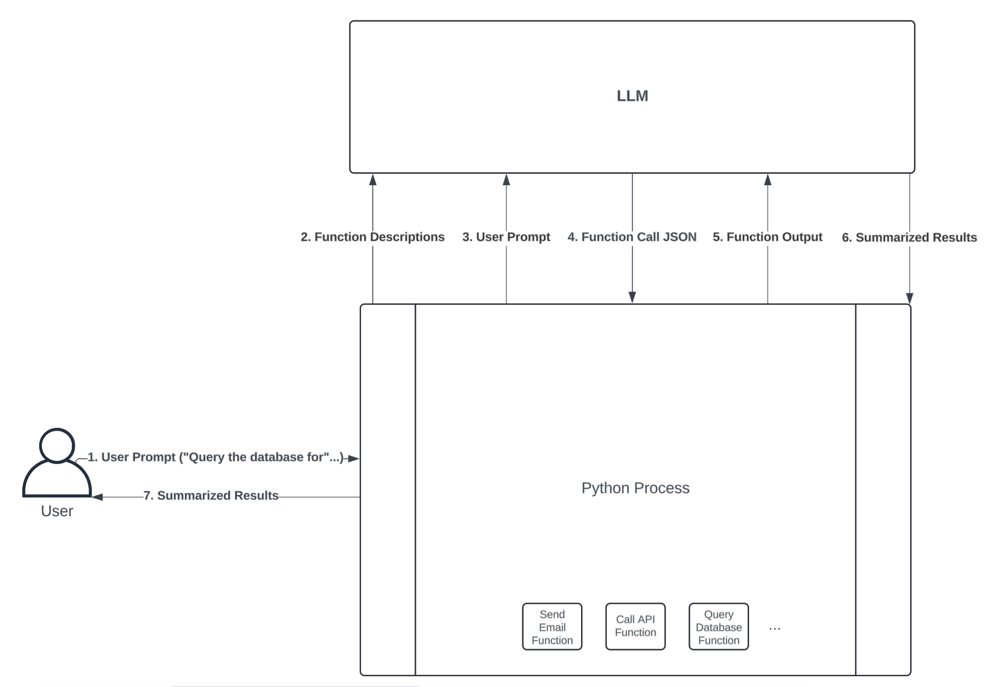

# Python MCP: Connect Your LLM With the World

🐍 Source: [Real Python Tutorial](https://realpython.com/python-concurrency/)
- 2025/09/30

## Overview

- [MCP Documentation](https://modelcontextprotocol.io/docs/getting-started/intro)
- What MCP is and why it was created
- What MCP prompts, resources, and tools are
- How to build an MCP server with customized tools
- How to integrate your MCP server with AI agents like Cursor
- Build a simple MCP server that interacts with a simulated e-commerce database
- Use Cursor’s MCP client, which saves you from having to implement your own.

## Installing Python MCP

Python MCP is available on PyPI, and you can install it with pip.

## What is MCP?

- What MCP is and the problem it tries to solve.
- Explore MCP’s core primitives—prompts, resources, and tools.

### Understanding MCP

The Model Context Protocol is a protocol for AI language models that standardizes how they interact with the outside world. This interaction most often involves performing actions like sending emails, writing and executing code, making API requests, browsing the web, and much more.

**Function calling**—a process through which LLMs execute predefined functions in a programming language like Python.



1. User Prompt: The user first sends a prompt to the Python process. For example, the user might ask a question that requires a database query to answer, such as “How many customers have ordered our product today?”

2. Function Descriptions: The Python process can expose several functions to the LLM, allowing it to decide which one to call. You do this by **type hinting your functions’ input arguments** and **writing thorough docstrings** that describe what your functions do. An LLM framework like **LangChain will convert your function definition into a text description** and send it to an LLM along with the user prompt.

3. User Prompt: In combination with the function descriptions, the LLM also needs the user prompt to guide which function(s) it should call.

4. Function Call JSON: Once the LLM receives the user prompt and a description of each function available in your Python process, it can decide which function to call by sending back a JSON string. The JSON string must include **the name of the function** that the LLM wants to execute, as well as **the inputs to pass to that function**. **If the JSON string is valid**, then your Python process can **convert it into a dictionary** and **call the respective function**.

5. Function Output: If your Python process successfully executes the function call specified in the JSON string, it then sends the function’s output back to the LLM for further processing. This is useful because **it allows the LLM to interpret and summarize the function’s output in a human-readable format**.

6. Summarized Results: The LLM returns summarized results back to the Python process. For example, if the user prompt is “How many customers have ordered our product today?”, the summarized result might be “10 customers have placed orders today.” Despite all of the work happening between the Python process and the LLM to query the database in this example, the user experience is seamless.

7. Summarized Results: Lastly, the Python process gives the LLM’s summarized results to the user.

The power of MCP lies in its **standardized architecture built around clients and servers**. 
- An MCP server is **an API** that **hosts the prompts, resources, and tools you want to make available to an LLM**.
- An MCP client acts as the bridge between the LLM and the server:
  - exposing the server’s content, 
  - receiving input from the LLM, 
  - executing tools on the server, and 
  - returning the results back to the model or end user.

**Note**: The user prompt goes through the Python process before reaching the LLM. Tool calling processes, like LangChain or Cursor, receive your user prompt before passing it to the underlying LLM via an API call. In this way, you’re not directly interacting with the LLM API. Instead, the Python process, or any other tool you’re using, acts as a mediator between you and the LLM.

Unlike in the diagram above, where everything executes through a single process, you typically **deploy MCP clients and servers as separate, decoupled processes**. Users typically interact with MCP clients hosted in chat interfaces rather than making requests directly to servers. This is massively advantageous because any **MCP client can interact with any server that adheres to the MCP protocol**.

In other words, **if you have an MCP client hosted in, say, a chat interface**, you can connect as many MCP servers as the client supports. **You, as an MCP server developer, can focus solely on creating the tools you need your LLM applications to use rather than spending time writing boilerplate code to create the interaction between your tools and the LLM**.

For the broader open-source community, this means developers don’t have to waste time writing custom integrations for commonly used services like GitHub, Gmail, Slack, and others. In fact, the vast majority of companies that developers rely on have already created [MCP servers for their services](https://github.com/modelcontextprotocol/servers?tab=readme-ov-file#%EF%B8%8F-official-integrations).

MCP is also useful if you work for a large organization or want to avoid rewriting logic when you switch LLM frameworks. Simply expose what your organization needs through MCP servers, and any application with an MCP client can leverage it.

### Primitives of MCP Servers: Prompts, Resources, and Tools

Prompt engineering framework: LangChain, LangGraph, LlamaIndex, etc. 

Prompts define reusable templates that guide LLM interactions. They allow servers to expose structured inputs and workflows that users or clients can invoke with minimal effort. Prompts can **accept arguments, reference external context, and guide multi-step interactions**.

Storing prompts on MCP servers allows you to reuse instructions that you’ve found helpful with LLM interactions in the past. You can think of a prompt as a formatted Python string. For example, if you want any LLM to read and summarize customer reviews, then you might add the following prompt to your MCP server:

```Python
"""
Your job is to use customer reviews to answer questions about
their shopping experience. Use the following context to answer
questions. Be as detailed as possible, but don't make up any
information that's not from the context. If you don't know an
answer, say you don't know.

{context}

{question}
"""
```

